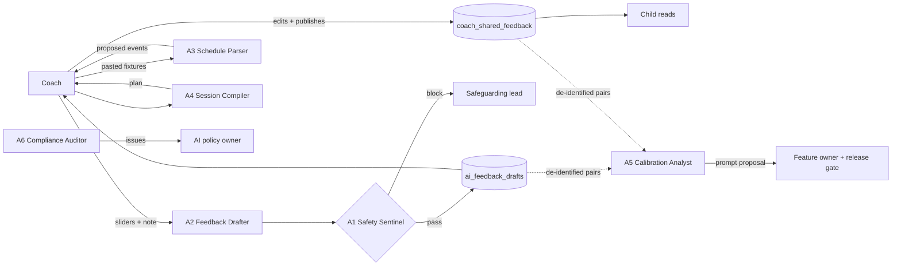

# Compounding System

*Session: 26 September 2026. Checked against `origin/main` at `d963ce6`.*

> **State on `origin/main`, 26 September.** T2 is merged
> (`20260920140000_coach_approved_feedback.sql`). Pilot guarantee **G7** then disabled all AI:
> the three AI endpoints return `403 PILOT_FEATURE_DISABLED` before reading anything
> (`20260923110906_pilot_g7_disable_media_and_ai.sql`, `src/__tests__/pilot-ai-disabled.test.ts`).
> Loop scores are unchanged: nothing learns. The code described below is the AI code as it stood
> before G7, and it is what would come back if AI were re-enabled unchanged.

**Goal:** map Trak's compounding architecture: which loops learn, which only scale, and where the
gap between them leaves Trak exposed.

Sketch loops that learn, not throughput charts. A loop compounds only if this season's usage makes
next season's output *better*. A loop that only produces *more* output does not count.

---

## Feedback Loops

| Loop | Input | Output | Compounds? | Status |
|---|---|---|:---:|---|
| **Recursive Learning.** The coach's correction of an AI draft improves the next draft. | Coach's raw words, the AI draft, the coach's edit and the band they sign | Next draft calibrated to that coach and age group | **N** | **broken** |
| **Cross-Domain Transfer.** What Trak learns in one area improves another. | Assessment scores | A session-plan suggestion in `coach-assistant` | **N** | **broken** (one hop, one direction, hand-written in a prompt) |
| **Network Intelligence.** Each new academy makes the product better for all of them. | Nothing crosses academies | Nothing | **N** | **missing** (by design: cross-academy isolation, K1) |

**Score: 0 of 3 loops compound.** This matches the [data flywheel](../02-the-moat/data-flywheel.md)
score of 5 / 20 two weeks earlier. Nothing merged since then learns.

### What is in the code today

- **Three AI functions (disabled under G7), one model, no memory.** `coach-assistant`, `parse-schedule` and
  `player-feedback` all call `google/gemini-3-flash-preview` through the Lovable gateway. None of
  them writes back to the database. Every call starts from zero.
- **The prompts are fixed text in the code.** Each of the three is hand-edited in its own
  `index.ts`. There is no record of which prompt version or model produced which output.
- **The rating engine uses fixed constants.** `src/lib/rating-engine.ts` treats every coach,
  academy and age group the same. One coach's "Good" is another's "Standout", and nothing corrects
  for that.

### Loops that only scale

These are real loops, and they grow with usage. None of them makes the next output better.

| Loop | What grows | Why it does not learn |
|---|---|---|
| Match logging → player record | Rows in `matches` | More history for a player, but it never feeds any AI output or the rating engine's calibration |
| Assessments → passport | Rows in `coach_assessments` | Grows each player's record. The AI draft behind a row is not linked to the band the coach signed |
| AI calls → quota | `ai_usage_daily` counters | Measures spend (K8/X4), not quality. It holds a count and nothing else, by design |
| Telemetry → pilot scorecard | `telemetry_events` | Tells *the team* what happened. The product never reads it |
| Parent invites → linked families | More accounts per player | A distribution loop that grows reach, not intelligence |

**The gap.** Everything that grows is volume: records, calls, accounts, events. Nothing that grows
is judgement. Trak scales its costs (AI calls are metered per coach per day) faster than it scales
any advantage. The [margin module](../03-the-margin/cost-curve.md) found that AI cost can rise only
~2.3× before margin drops below 70%. A learning loop is the only thing that would let the same
spend buy better drafts over time.

**Where the gap is exposed.** Veo, per the [threat board](../02-the-moat/threat-board.md), captures
every coach correction *against footage*. Its loop learns. Trak's scales. Each season the gap
between them widens, and Trak cannot close it later: correction data that was never captured
cannot be recovered.

---

## Broken loop (partner found)

> **Coach edits an AI draft, and the edit is thrown away → fix: pair the draft with what the coach
> signed and published, on the same row, with a lawful purpose for reusing it.**

**Partner found: T2 already builds half of this loop.** T2 (merged as
`20260920140000_coach_approved_feedback.sql`, with its tables closed to application roles under G7)
adds two tables:

- `ai_feedback_drafts`, with `generated_text` and `model`
- `player_feedback`, with `published_text` and `draft_id`, where edits create a new version rather
  than overwriting the old one

T2 was written as a **safeguarding** control: no AI text reaches a child unapproved. As a side
effect, `generated_text` next to `published_text`, joined by `draft_id`, is a labelled correction
pair signed by a named coach. It is the same data the flywheel analysis asked for.

**What is still missing to close the loop:**

| # | Gap | Fix |
|---|---|---|
| 1 | T2 is merged, but G7 has disabled AI for the pilot | Lift G7 only after the processor agreement and DPIA are in place (`MVP Requirements`, "Cut from the pilot") |
| 2 | Pairs cover feedback *text*, not the *band* | Add `source_text`, `drafted_band` and `signed_band` to the assessment write path, the one move from the [data flywheel](../02-the-moat/data-flywheel.md) |
| 3 | `model` is recorded, but the prompt version is not | Add `prompt_version` to `ai_feedback_drafts`. Without it, a correction cannot be traced to the prompt that caused it. |
| 4 | Nothing reads the pairs | A weekly offline job: edit distance per coach and invented-claim rate, scored against the [golden dataset](../04-the-contract/golden-dataset.md). This is the reliability contract's fidelity metric, computed from live rows. |
| 5 | No legal basis to reuse minors' data for improvement | Add a separate consent purpose for model improvement to P2 guardian consent, *before* the first pair is written. If it is added afterwards, every pair written before it has to be thrown away. |

With 1–5 in place, Recursive Learning moves from **broken** to **active**. It is the only loop Trak
can make compound in one season without lawfully crossing academies.

### Partner audit: "What feedback loop is broken?"

*26 September 2026. This is a partner audit of the loops above and of the
[Governance Policy](#governance-policy) and [Agent Topology](#agent-topology) below. It checks for
two risks:*

- *Samsung-path risk: data leaks through a paste path.*
- *Air Canada-path risk: AI making promises the company can't keep.*

*Each finding was checked against `origin/main` at `d963ce6`.*

| # | Check | Finding | Evidence |
|---|---|---|---|
| L-1 | Corrections trashed? | **Yes, and it is happening today.** A coach's message is overwritten in place. `coach_shared_feedback` grants `UPDATE` on `body`, and the only trigger touches `updated_at`. Every revision a coach makes during the pilot is lost. | `20260918135500_private_notes_and_shared_feedback.sql` lines 104–174 |
| L-2 | Corrections trashed? | **Yes, by design.** Coaches can delete AI drafts. Deleting one sets `player_feedback.draft_id` to `NULL`, which removes the draft half of the pair. Rejected drafts, the strongest negative signal, leave no record. | `20260920140000_coach_approved_feedback.sql`: `GRANT SELECT, INSERT, DELETE`, plus a delete policy |
| L-3 | Corrections trashed? | **Yes.** The Safety Sentinel (A1) blocks drafts, but nothing stores the block reason, so the Calibration Analyst (A5) never learns from blocks. | Topology above: A1 has no output table |
| L-4 | Theoretical learning? | **Yes.** L1's learning step needs a model-improvement consent purpose that does not exist, and a weekly job that has no owner. On today's plan, A5 never runs. | Gap 5 above; A5 approval row |
| L-5 | Broken handoff? | **Yes.** A1 → the academy's safeguarding lead. Trak stores no safeguarding lead per academy and has no notification channel; notifications are cut from the pilot. The "within 24 hours" rule has no mechanism behind it. | `MVP Requirements` scope; no such column in migrations |
| G-1 | Missing data class? | **Yes.** The policy never lists data classes. Nothing states that coach private notes, safeguarding disclosures, images of children and guardian contact details are separate classes with separate rules. | Governance Policy, Scope |
| G-2 | Samsung-style paste path? | **Yes: the coach's own AI tools.** The pilot has coaches writing every message by hand. That invites them to paste the private note, with the child's name, into a personal chatbot and paste the result back. The policy scopes this out ("messages written entirely by a coach"). | Governance Policy, Scope |
| G-3 | Samsung-style paste path? | **Yes: the Schedule Parser (A3).** `parse-schedule` accepted pasted text *and screenshots* (`imageBase64`). A screenshot of a team chat or team sheet carries children's names and faces to the vendor. The topology first called A3 "adult-only data". That was false, and it is corrected below. | `parse-schedule/index.ts` before G7, lines 87–99 |
| G-4 | Air Canada-style promise? | **Yes.** The dormant coach assistant screen tells coaches its plans follow "UEFA coaching principles". Trak has no UEFA endorsement or review to back that claim. It returns with the assistant. | `src/pages/coach/CoachAssistant.tsx` line 359 |
| G-5 | Air Canada-style promise? | **Yes.** No rule stops a draft from promising outcomes: a team place, a trial, selection, a scholarship. Once a coach publishes such a draft, the academy has made that promise to a child. | Escalation triggers: no commitment trigger |
| G-6 | Air Canada-style customer bot? | **Not on `main`.** The pre-G7 player chat was one. The policy bans it only in a "recommend not building" list, which does not bind anyone. | Agent Topology |
| G-7 | Unapproved agent action? | **No.** Every write in the topology has a named approver. | — |
| G-8 | No review cadence? | **No.** Five cadences are set. | Audit cadence |

### Broken loop identified by partner

> **Corrections are trashed.** The loop's only learning signal, what a coach changed and what a
> coach refused, is destroyed at write time. Right now, in the manual pilot, every coach revision
> of a message is overwritten (L-1). When AI returns, rejected drafts are deleted (L-2) and blocked
> drafts leave no reason (L-3). The consent purpose that would allow any learning does not exist
> (L-4). Recursive Learning is not merely slow. It is unable to start.

### Fix plan

Owners follow the proposed roles in the Governance Policy. Dates are 2026.

| # | Fix | Closes | Owner | By |
|---|---|---|---|---|
| 1 | Add a new migration: an append-only `coach_shared_feedback_revisions` table. A `BEFORE UPDATE` trigger copies the old `body` and `published_at` there. The coach reads their own revisions; no one can update or delete them. Add a negative test under the coach role. | L-1 | Imad | 3 Oct |
| 2 | Add a new migration: revoke `DELETE` on `ai_feedback_drafts` and drop the delete policy. Add `discarded_at` and a `discard_reason`, chosen from a fixed list. A draft is never removed, only discarded. | L-2 | Imad | 3 Oct |
| 3 | Add `prompt_version`, `drafted_band` and `signed_band` in the same migration as fix 2. | Gaps 2–3 | Imad | 3 Oct |
| 4 | Add a `draft_safety_blocks` table (draft id, rule, excerpt hash, created_at) written by A1. A5 reads it as negative examples. | L-3 | AI feature owner | Before G7 lifts |
| 5 | Add a model-improvement purpose to guardian consent, as its own purpose with its own withdrawal, and write the DPIA section for it. Name Kostas as owner of A5's weekly run. | L-4 | Tarek | 17 Oct |
| 6 | Add a named safeguarding lead to each academy's agreement. During the pilot, A1 escalations go by email from a founder to that lead, logged in the pilot runbook. | L-5 | Tarek | 10 Oct |
| 7 | Add the data-class table below to the policy. | G-1 | Dimos | **Done in this document** |
| 8 | Bring coaches' own AI tools into scope. Add to the coach manual and the academy agreement: "Never paste a private note, a child's name or a screenshot of a child into any AI tool. Trak's drafter is the only approved one." | G-2 | Kostas | 10 Oct |
| 9 | A3 accepts text only, with no images. It replaces any roster name in the pasted text with a placeholder before the text leaves Trak. | G-3 | AI feature owner | Before G7 lifts |
| 10 | Delete the "following UEFA coaching principles" sentence from `CoachAssistant.tsx`. | G-4 | Kostas | 3 Oct |
| 11 | Add escalation trigger 8, *commitment language*: A1 blocks any draft that mentions selection, a team place, trials, scholarships, "guarantee", or future outcomes stated as fact. Add two golden rows for it. | G-5 | AI feature owner | Before G7 lifts |
| 12 | Turn "no conversational agent" into an autonomy boundary, not a recommendation. | G-6 | Dimos | **Done in this document** |

Fixes 1–3 go into one migration, merged before the pilot's second week. From that point the pilot
keeps every correction a coach makes, whether or not AI ever returns.

---

## Context Connectivity

> **Where are the knowledge silos?** They sit between data Trak already holds and the AI that could
> use it.

| Silo | What is known | Who could use it but can't | Connect by |
|---|---|---|---|
| **Coach's private notes ↔ session planning** | `coach_assessment_notes`: the coach's own words about a player | `coach-assistant` reads only the five numeric score averages over 30 days | Pass the latest note summary per player into the squad context, gated by the same coach-ownership check |
| **Matches ↔ assessments ↔ feedback** | `matches` (minutes, position, opponent, `match_date`) | Neither `player-feedback` nor `coach-assistant` reads `matches` at all | Give the feedback draft the match it follows. The assessment already sits within 48 hours of that match (scorecard metric). |
| **Schedule ↔ sessions** | `parse-schedule` extracts events from a pasted schedule | The events never feed a session plan. `coach-assistant` output is returned and not stored. | Store accepted session plans against the calendar event, so the next plan knows what was trained |
| **Attendance ↔ everything** | Attendance follows the roster (`20260917000006`) | No AI function reads it | Low priority. Useful only after the three above. |
| **Across academies** | Each academy's full record | Every other academy: blocked by RLS (K1) | **Keep it blocked.** The only lawful bridge is anonymised calibration by age group, and only with a consent purpose designed in advance. The isolation *is* the regulatory moat. |

**Pattern:** every silo sits on the *input* side. Trak already stores the context. The prompts
don't read it. Connecting it is prompt and query work, not new data collection, so it adds no GDPR
purpose. It stays inside one coach's own academy data.

---

## Freeze test

> *Freeze the product for 3 months (≈ one frontier model cycle). Does Trak still win? If yes, it is
> not compounding.*

**Yes. Frozen, Trak loses nothing it has today**, because nothing it has today learns. What it
would keep:

- the coach's signature
- guardian consent
- cross-academy isolation
- the academy relationship

These are **scale and trust positions**, not compounding ones. A competitor who ships a better
model during the freeze gets better drafts overnight. Trak would get the same upgrade by changing a
model string, which proves the drafts come from the model and not from Trak.

**What would make the answer "No":** after one season with the broken loop fixed, a frozen Trak
would lose ground, because its per-coach calibration would stop improving. That is the test to
rerun at the end of the pilot season.

---

## Summary

| | Now | After the fix |
|---|---|---|
| Loops that compound | 0 / 3 | 1 / 3 (Recursive Learning) |
| Loops that only scale | 5 | 5 (unchanged, and that is fine) |
| Knowledge silos connected | 0 / 4 inside one academy | 2 / 4 (notes and matches into drafts) |
| Freeze test | Still wins → not compounding | Loses ground → compounding |
| Cheapest next step | During the G7 pilot: add `prompt_version` and the band fields, and the model-improvement consent purpose, in one change, ready for re-enablement | |

---

## Governance Policy

One page, in the workshop's five sections. It applies to every agent in the
[Agent Topology](#agent-topology) below. The full policy, with the reasons behind
each rule, lives in Product Office: `product/strategy/trak-guardrails/ai-governance-policy.md`.

**Status today:** pilot guarantee G7 keeps every product agent off. This policy is
the set of conditions for switching them back on.

### Scope

**What this policy covers:**

- Every model call Trak makes about a player, a coach or an academy, whether
  it runs live in the app or offline in a batch job.
- The agents that build Trak's code or change its infrastructure.
- Any vendor feature that sends Trak data to a model.

- Any AI tool a coach or academy staff member uses to write Trak content,
  including personal chatbots.

**Out of scope:** the coach's own judgement.

### Data classes

| Class | Examples | May go to a model? |
|---|---|---|
| C1 Child identity | Name, date of birth, age band, shirt number, photo | **Never.** Names are replaced with a placeholder before any call. No images of children, ever. |
| C2 Child development | Slider scores, bands, match minutes, focus labels | Yes, to the approved vendor, without identity attached |
| C3 Coach private note | The free-text note behind an assessment | Yes, only to draft *that* coach's message, with names replaced |
| C4 Safeguarding | A disclosure, a welfare concern | **Never.** A1 blocks the draft and escalates. The content goes to the safeguarding lead only. |
| C5 Guardian data | Guardian names, email, phone, consent records | **Never** |
| C6 Adult operational | Fixture lists, venues, times | Yes, as text only (no screenshots) |

### Autonomy boundaries

| OK solo (no human step) | Needs a human |
|---|---|
| Draft text into a coach-only table | Anything a child or parent can read: the coach publishes it (G4) |
| Parse a pasted schedule into *proposed* events | Saving events to the calendar: the coach confirms |
| Block a draft that fails a safety check | Unblocking it: the coach rewrites it, or the safeguarding lead clears it |
| Compute calibration statistics offline, from de-identified pairs | Changing a live prompt or model: feature owner + release gate |
| Run the shadow-AI audit and open an issue | Revoking a key or changing a vendor: AI policy owner |
| Read the coach's own squad and academy data | Reading across academies: never, except anonymised aggregates under L3 |
| — | Holding a conversation with a child, a parent or an academy buyer: **never, by any agent, with no exceptions** |

### Escalation triggers

**A human must step in when any of these happens:**

1. A coach note or a draft suggests harm, abuse or a safeguarding disclosure.
   The draft is blocked, and the academy's named safeguarding lead is emailed
   by a founder within 24 hours (fix 6). The model never writes about it.
2. A draft states a fact that is not in its source: a number, an injury, or a
   claim about the family. Block the draft, then review it in the weekly eval.
3. A coach's drafts are published with more than 90% unedited and a median
   review under 20 seconds (the rubber-stamp alarm).
4. Band agreement falls more than 10 points week-on-week, or fidelity falls
   below 92%.
5. Any child data reaches a vendor that is not on the approved list.
6. Prompt injection is detected in a coach note or a pasted schedule.
7. Spend passes 80% of a function's daily quota across the academy.
8. A draft uses commitment language: selection, a team place, trials, a
   scholarship, "guarantee", or a future outcome stated as fact. A1 blocks it,
   and the coach rewrites it.

### Audit cadence

| What | Cadence |
|---|---|
| Safety check on every draft (safety leaks and invented claims) | **real-time** |
| Rubber-stamp alarm, quota spend, blocked drafts | **daily** |
| Golden-set rerun, band agreement, edit distance, J7 opens for AI-assisted vs hand-written messages | **weekly** |
| Calibration promotion decision; review of the agent registry | **monthly** |
| Shadow-AI audit, DPIA review, vendor review, this policy | **quarterly**, and before G7 is lifted |

### Regulatory exposure (EU AI Act / GDPR / sector)

**Regimes that apply:**

- **GDPR:** Art. 8 (children's consent), 22 (automated decisions), 28 (processors),
  35 (DPIA).
- **EU AI Act:** Art. 50 transparency for AI-generated text; each use case still
  needs classifying.
- **UAE:** PDPL and the child digital-safety law cited in Trak's deck, since the
  UAE is the first market. This citation is unverified.
- **Sector:** child-safeguarding duties at each academy.

**Risk tier: `limited` (proposed).** The coach signs everything, and no agent
takes a selection, access or scouting decision. One open question for counsel:
Annex III lists AI that evaluates learning outcomes in education and vocational
training as **high** risk. If an academy counts as such an institution, the
Feedback Drafter moves to `high`. No agent goes live before counsel answers.

---

## Agent Topology

### Recommendation: what to build

Recommend building **six agents**. Three are live and three work offline, and
each one closes a loop or a silo identified above.

**Rule 1: the Safety Sentinel ships first, and every child-related agent runs
behind it.**

**Rule 2: the orchestrator is deterministic code, not an agent.** No agent calls
another agent's write path. Agents hand their results to a table, and a person
or a coded gate moves them onward.

| # | Agent | Closes | Tier | Build when |
|---|---|---|---|---|
| A1 | **Safety Sentinel**: checks every draft for safety leaks, invented claims, disclosures and injection | Escalation triggers 1, 2, 6 | 2 | Now, offline against the golden dataset (G7 does not block this) |
| A2 | **Feedback Drafter**: drafts the coach's message and bands from the sliders and the note | Recursive Learning (source of pairs) | 2 | First after G7 lifts, only behind A1 |
| A3 | **Schedule Parser**: turns a pasted fixture list into proposed events | Schedule ↔ sessions silo | 1 | After G7, and only once it takes text only with roster names replaced (fix 9) |
| A4 | **Session Compiler**: turns the squad's weakest categories, the last match and the focus labels into a session plan, and records it. The coach judges; the agent compiles (the cost-curve Filler). | Cross-Domain Transfer | 1 | Mid-season 1 |
| A5 | **Calibration Analyst**: offline, weekly; computes per-coach band offsets and proposes a new `prompt_version` | Recursive Learning (the learning step) | 0 (de-identified) | Once there are ≥4 weeks of pairs, and only after the consent purpose exists |
| A6 | **Compliance Auditor**: quarterly shadow-AI re-audit (greps, commit history, vendor list); opens an issue | Governance audit cadence | 0 | Now |

**Recommend *not* building:**

- **A player chat agent.** It would be an unreviewed AI dialogue with a child.
  The pre-G7 chat was exactly this.
- **A scouting or ranking agent.** It would move Trak to the high-risk tier and
  break the pilot's "no rankings" boundary.
- **An agent that sends parent messages automatically.** G5 requires that no
  message goes to the wrong adult, and parents do not read coach messages today
  (TRAK-63).

### What each agent can do · what it can't · who approves

| Agent | Can do | Can't do | Who approves |
|---|---|---|---|
| A1 Safety Sentinel | Read each draft and its source; block it; record the reason in `draft_safety_blocks`; queue an escalation for a founder to send to the safeguarding lead | Edit or unblock a draft; reply to a child; contact anyone directly; see other academies | Changes to its rules: the privacy lead (Tarek) + the independent reviewer (Makis). Clearing a disclosure: the academy's safeguarding lead. |
| A2 Feedback Drafter | Read one assessment, its private note and its scores; write to `ai_feedback_drafts` with `model` + `prompt_version` | Publish; write to `coach_shared_feedback`; read other players; see C1, C4 or C5 data; send any name to the vendor | **Every message: the coach**, by editing and publishing. Prompt or model changes: the feature owner + the release gate (Imad). |
| A3 Schedule Parser | Read pasted text, with roster names replaced; propose events | Accept images; save to the calendar; read squad or child data | Each import: the coach. Prompt changes: the feature owner. |
| A4 Session Compiler | Read the squad's scores, the last match, focus labels and attendance for the coach's own academy; propose and record a plan | Write anything a family can read (only the fixed focus labels ever reach families); make improvement claims to children | Each plan: the coach. The focus-to-improvement table: never shown outside the coach view. |
| A5 Calibration Analyst | Read de-identified draft↔signed pairs; compute offsets; open a prompt proposal | Deploy a prompt; read identifiable rows; cross academies (L3 aggregates only, minimum cell size) | Promotion: the feature owner + the release gate, after a golden-set pass. L3 aggregates: the privacy lead. |
| A6 Compliance Auditor | Read the repo, commit history, migrations and vendor list; open issues | Change code, secrets or vendor settings; read production data | Its findings: the AI policy owner (Kostas) triages them |

**Only the coach, a human, is ever on the path to a child.** No agent in this
topology writes anything a child or a parent can read.
